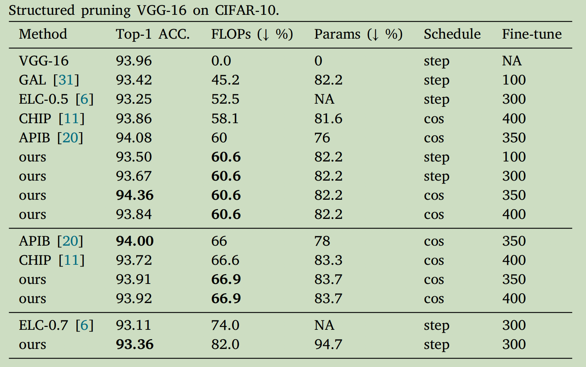
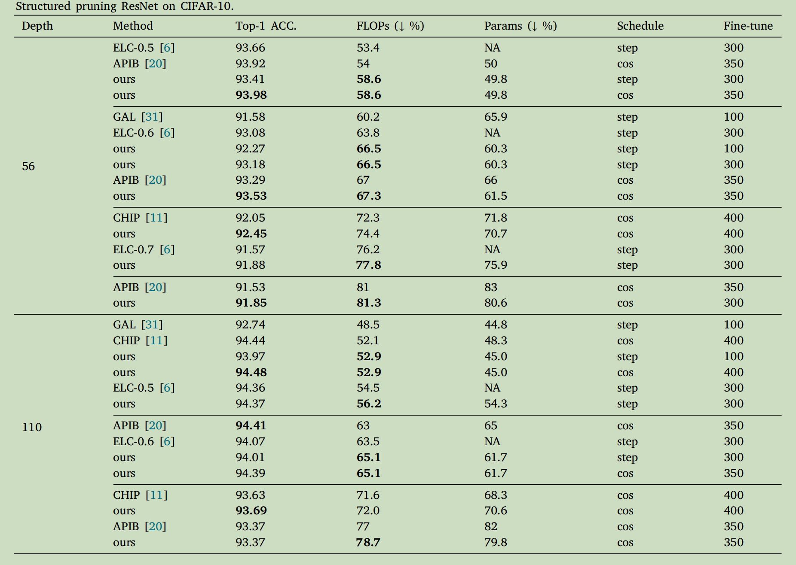
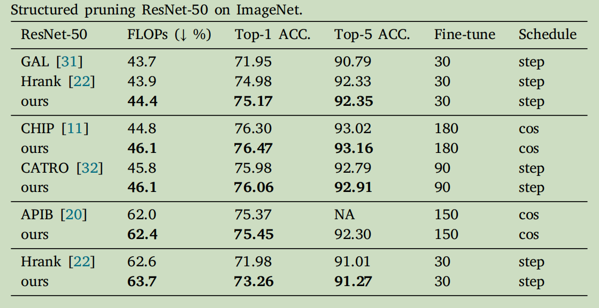
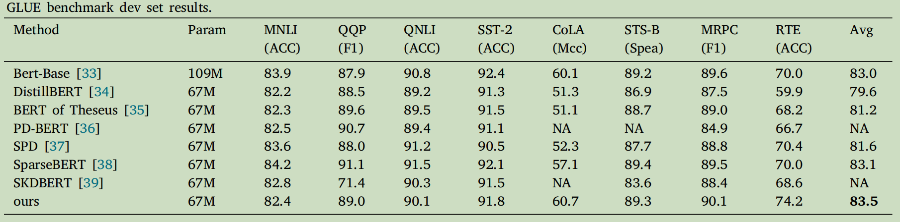

It is a PyTorch implementation of network pruning with ADMM described in *Network slimming using Lp (p< 1) regularization*. The paper is lined by https://www.sciencedirect.com/science/article/abs/pii/S0031320325003711.

## Introduction

Convolutional neural networks (CNNs) require significant computational resources, making them challenging to deploy on battery-powered devices. Channel pruning provides a practical solution by reducing model size to facilitate efficient deployment. Among various pruning methods, $L_0$ regularization is an effective approach for identifying sparse sub-networks. However, solving it directly is NP-hard. To overcome this challenge, we approximate the $L_0$ norm using $L_p$ regularization with $p < 1$, and employ the Alternating Direction Method of Multipliers (ADMM) to solve the corresponding optimization problem. Since the $L_p$ regularization term introduces a non-convex subproblem, we linearize it to transform the subproblem into a convex optimization problem. Nevertheless, when the model parameter approaches zero, the $L_p$ norm grows excessively, leading to no convergence in ADMM. To address this, we introduce a synaptic inhibition mechanism to suppress the excessive growth of the $L_p$ regularization term, ensuring ADMM algorithm convergence. Experiments on CIFAR, ImageNet, and GLUE benchmark dataset demonstrate that our method achieves state-of-the-art performance in channel pruning.

## Experiment Results
Structured pruning VGG-16 on CIFAR-10:


Structured pruning ResNet on CIFAR-10:


Structured pruning ResNet-50 on ImageNet:


Structured pruning BERT on GLUE:


## Running Code
You can simply run code by:

python main.py

Take ResNet-50 as an example. You can run code by:

python main.py --p 5 --M 1 --rho 1.5e-3 --ratio 0.95 --adjust 0.45

## Citation
If you find this work helpful, please consider citing our paper.

```bibtex
@article{ji2025network,
  title={Network slimming using Lp (p< 1) regularization},  
  author={Ji, Fengrui and Chen, Xinwang and Chu, Renxin and Liu, Baolin},  
  journal={Pattern Recognition},  
  pages={111711},  
  year={2025},  
  publisher={Elsevier}
}
